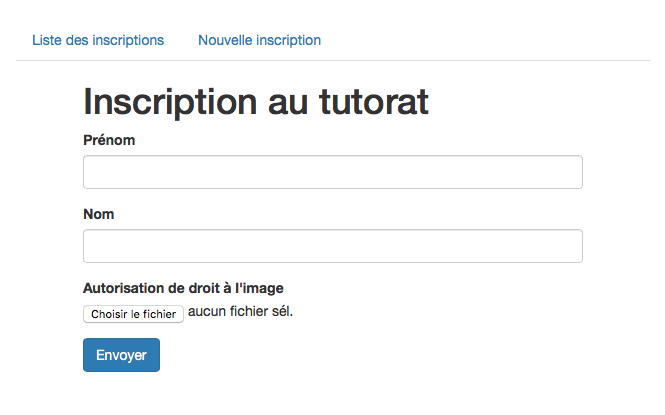

# exemple-upload-django

Ceci est un exemple, sous Django, de gestion de fichiers uploadés par un utilisateur dans le cadre d'un formulaire.

Il s'agit d'une petite application CRD (Create, Read, Delete) autour d'un modèle très simple de dossier d'inscription pour lycéen, comprenant 3 champs :

- Prénom
- Nom
- Autorisation de droit à l'image

Ce dernier champ est un champ de fichier où l'utilisateur doit fournir un fichier PDF. Pour tester l'application, on pourra utiliser `sample-data/doej.pdf`.

On peut consulter la liste des dossiers, supprimer un dossier existant ou ajouter un nouveau dossier.




## Installation

Après avoir clôné le repo :

```sh
# Recommandé : créez un environnement virtuel
$ virtualenv env
$ . env/bin/activate

# Installez les dépendances
$ pip install -r requirements.txt

# Initialisez la DB
$ cd uploadexample
$ python manage.py makemigrations
$ python manage.py migrate

# Lancez le serveur de dev
$ python manage.py runserver
```

Le site sera accessible à l'adresse `http://localhost:8000/`.

### API

Au cas où on voudrait utiliser cette app avec un frontend JS, une petite API REST a été implémentée à l'aide du Django REST Framework.

Les ressources utiles sont dispos sur le serveur Django :

- Browsable API : `http://localhost:8000/api/`
- Documentation : `http://localhost:8000/api/docs/`


## Notes d'implémentation

#### Stockage de fichiers uploadés dans Django : les médias

Pour activer le stockage des fichiers de médias par Django, on définit les paramètres suivants dans `settings.py` :

```python
# uploadexample/settings.py

# URL pour accéder à une ressource de type média
MEDIA_URL = '/media/'

# Dossier où seront stockés les médias
MEDIA_ROOT = os.path.join(BASE_DIR, 'media')
```

Lorsqu'un fichier est uploadé via un formulaire, Django le placera dans le dossier indiqué par MEDIA_ROOT en ayant au préalable éventuellement ajouté un hash à son nom (pour éviter les doublons). Il sera accessible à l'adresse `<MEDIA_URL>/<nom_du_fichier>` sur le serveur Django.

#### Service des médias en développement

Dans un contexte de développement, on peut se permettre de servir les fichiers de médias et les fichiers statiques par Django.

```python
# uploadexample/urls.py

if settings.DEBUG:
    urlpatterns += static(settings.MEDIA_URL,
                          document_root=settings.MEDIA_ROOT)
    urlpatterns += static(settings.STATIC_URL,
                          document_root=settings.STATIC_ROOT)
```

> **Cette approche n'est pas efficace en production** : la solution à employer et alors de passer par un serveur web dédié aux fichiers statiques et aux médias, tel que nginx.

#### Écriture du modèle

Sur le modèle, on utilise un champ `FileField` :

```python
# upload/models.py

class StudentRegistration(models.Model):
	...
	image_agreement = models.FileField("autorisation de droit à l'image")
	...
```

#### Côté front

La gestion du formulaire côté frontend est ici assurée par le système de vues et de templates inclus Django (et ne passe pas par l'API).

Les templates utilisés sont dans le dossier `upload/templates`. La chose la plus importante à noter concerne le `<form>` de création d'un nouveau dossier d'inscription : il doit définir `enctype="multipart/form-data` pour permettre la transmission de fichiers via la requête HTTP POST.

```html
<!-- upload/templates/upload/registration_create.html -->
<form action="" method="post" enctype="multipart/form-data">
```

#### Accès aux fichiers de médias par leur URL

Django stocke les fichiers sur le serveur et expose l'URL du fichier via l'attribut `url` d'un `FileField`. Dans la page de liste des inscriptions, on utilise cet attribut pour créer un lien vers le fichier correspondant :

```html
<!-- upload/templates/upload/registration_list.html -->
<a href="{{ registration.image_agreement.url }}">Droit à l'image</a>
```

L'API REST expose l'URL dans la réponse JSON. Un frontend JS pourrait alors utiliser cette URL pour, par exemple, l'associer à un lien ou afficher le PDF directement sur la page. La réponse JSON associée à `GET /registrations/` ressemble typiquement à :

```json
[
    {
        "id": 65,
        "first_name": "John",
        "last_name": "Doe",
        "image_agreement": "http://localhost:8000/media/doej.pdf",
        "submission_date": "2018-02-10"
    },
    ...
]
```

### Gestion des fichiers inutilisés

Lorsqu'un modèle ayant un ou plusieurs champs `FileField` est supprimé, les fichiers correspondants deviennent "orphelins", c'est-à-dire qu'ils n'ont plus de références dans les modèles mais restent physiquement sur le serveur. Django choisit délibérément de ne pas supprimer automatiquement le fichier physique associé.

On doit alors supprimer manuellement ou par une tâche périodique (job Cron) les fichiers inutilisés. Une commande de gestion a été définie dans cet exemple (voir `upload/management/commands/clean_media.py`) et s'utilise comme suit :

```sh
$ python manage.py clean_media
# Si des médias inutilisés sont détectés :
Unused media files were detected:
doej.pdf
Removed 1 unused media file(s).
# Sinon :
No unusued media files detected.
```

Cette commande n'est pas spécifique à cette application et se contente de **supprimer tous les fichiers qui ne sont référencés par aucun modèle de la DB**. On pourrait la réutiliser dans une autre application.
