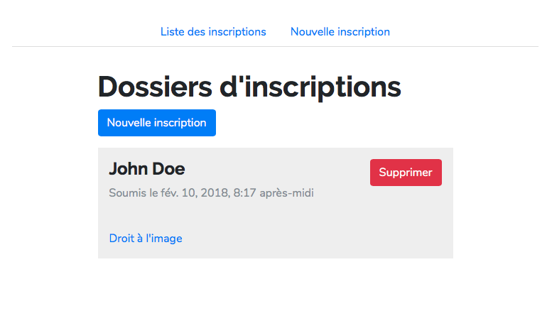
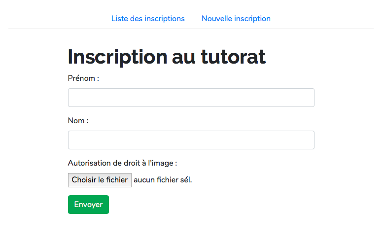

# exemple-upload-django

Ceci est un exemple, sous Django, de gestion de fichiers uploadés par un utilisateur dans le cadre d'un formulaire.

Il s'agit d'une petite application CRD (Create, Read, Delete) autour d'un modèle très simple de dossier d'inscription pour lycéen, comprenant 3 champs :

- Prénom
- Nom
- Autorisation de droit à l'image

Ce dernier champ est un champ de fichier où l'utilisateur doit fournir un fichier PDF. Pour tester l'application, on pourra utiliser `sample-data/doej.pdf`.




## Installation

Après avoir clôné le repo :

```sh
# Recommandé : créez un environnement virtuel
$ virtualenv env
$ . env/bin/activate

# Installez les dépendances
$ pip install -r requirements.txt

# Initialisez la DB
$ cd uploadexample
$ python manage.py makemigrations
$ python manage.py migrate

# Lancez le serveur de dev
$ python manage.py runserver
```

## Notes d'implémentation

#### Stockage de fichiers uploadés dans Django : les médias

Pour activer le stockage des fichiers de médias par Django, on définit les paramètres suivants dans `settings.py` :

```python
# uploadexample/settings.py

# URL pour accéder à une ressource de type média
MEDIA_URL = '/media/'

# Dossier où seront stockés les médias
MEDIA_ROOT = os.path.join(BASE_DIR, 'media')
```

Lorsqu'un fichier est uploadé via un formulaire, Django le placera dans le dossier indiqué par MEDIA_ROOT en ayant au préalable éventuellement ajouté un hash à son nom (pour éviter les doublons). Il sera accessible à l'adresse `<MEDIA_URL>/<nom_du_fichier>` sur le serveur Django.

#### Service des médias en développement

Dans un contexte de développement, on peut se permettre de servir les fichiers de médias et les fichiers statiques par Django. **Cette approche n'est pas efficace en production** : la solution à employer et alors de passer par un serveur web dédié aux fichiers statiques et aux médias, tel que nginx.

```python
# uploadexample/urls.py
if settings.DEBUG:
    urlpatterns += static(settings.MEDIA_URL,
                          document_root=settings.MEDIA_ROOT)
    urlpatterns += static(settings.STATIC_URL,
                          document_root=settings.STATIC_ROOT)
```

#### Écriture du modèle

Sur le modèle, on utilise un champ `FileField` :

```python
# upload/models.py
class StudentRegistration(models.Model):
	...
	image_agreement = models.FileField("autorisation de droit à l'image")
	...
```

Le *serializer* est tout-à-fait classique et est défini dans `upload/serializers.py`.

#### Côté front

La gestion du formulaire côté frontend est ici assurée par le Django REST Framework (rendu d'un *serializer* comme un formulaire). Ce n'est pas une nécessité et le front pourrait tout aussi bien se faire en JS (même si cet exemple ne dispose pas d'une API REST et serait donc à adapter).

Les templates utilisés sont dans le dossier `upload/templates`. La chose la plus importante à noter concerne le `<form>` de création d'un nouveau dossier d'inscription : il doit définir `enctype="multipart/form-data` pour permettre la transmission de fichiers via la requête HTTP POST.

```html
<!-- upload/templates/upload/registration_create.html -->
<form action="" method="post" enctype="multipart/form-data">
```

#### Accès aux fichiers de médias par leur URL

Django stocke les fichiers sur le serveur et expose l'URL du fichier via l'attribut `url` d'un `FileField`. Dans la page de liste des inscriptions, on utilise cet attribut pour créer un lien vers le fichier correspondant :

```html
<!-- upload/templates/upload/registration_list.html -->
<a href="{{ registration.image_agreement.url }}">Droit à l'image</a>
```

Dans le cas d'un frontend Javascript, il est tout-à-fait envisageable de fournir l'URL directement dans le JSON d'une requête de type `GET /api/registrations/`. Libre au front d'utiliser cette URL comme bon lui semble : lien vers le fichier ou affichage direct dans la page... La réponse JSON ressemblera typiquement à:

```json
[
	{
		"first_name": "John",
		"last_name": Doe",
		"url": "http://localhost:8000/media/doej.pdf"
	},
	...
]
```

## Gestion des fichiers inutilisés

Lorsqu'un modèle ayant un ou plusieurs champs `FileField` est supprimé, les fichiers correspondants ne sont pas supprimés du serveur, et deviennent inutilisés (c'est un choix délibéré du framework).

On doit alors supprimer manuellement ou par une tâche périodique (job Cron) les fichiers inutilisés. Une commande de gestion a été définie dans cet exemple (définie dans `upload/management/commands/clean_media.py`) et s'utilise comme suit :

```sh
$ python manage.py clean_media
# Si des médias inutilisés sont détectés :
Detected unused media files:
	doej.pdf
Deleted 1 unused media file(s).
# Sinon :
No unusued media files detected.
```

Cette commande n'est pas spécifique à cette application et se contente de **supprimer tous les fichiers qui ne sont référencés par aucun modèle de la DB**.
